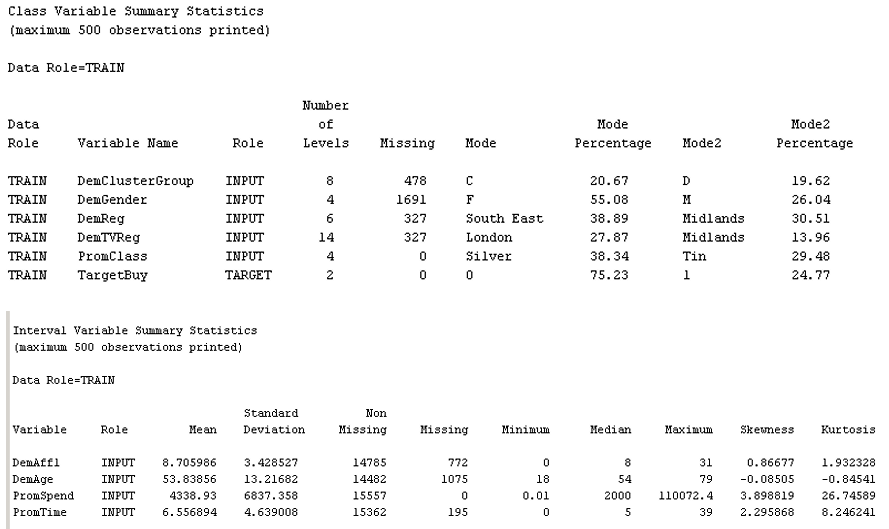

# Predictive Models for Target Marketing

## Overview
This project demonstrates the use of predictive modeling techniques in SAS Enterprise Miner to determine which customers are likely to purchase a new clothing line. The goal is to provide actionable insights for the department store's target marketing strategy.

## Business Case
A department store has launched a new clothing line and seeks to identify potential buyers using data from its customer loyalty program. The Customer_Purchase dataset contains 12 variables and over 15,000 observations, which are used to build and evaluate predictive models to address the business problem.

## Repository Structure
- **SASpackages/**: SAS diagrams.
- **results/**: Model outputs and demos (decision trees, regressions, model comparison, etc.).
- **reports/**: Project summary and findings.
- **docs/**: Research and additional documentation on model issues.
- **README.md**: Main project description and instructions.

## Tools and Technologies
- **SAS Enterprise Miner**: For predictive modeling and analysis.
- **Microsoft Office**: For preparing reports and visualizations.

## Table of Contents
1. [Setup and Data Preparation](#1-setup-and-data-preparation)
2. [Decision Tree Models](#2-decision-tree-models)
3. [Regression Models](#3-regression-models)
4. [Model Evaluation and Insights](#4-model-evaluation-and-insights)
5. [Additional Research on Data Issues](#5-additional-research-on-data-issues)

## 1. Setup and Data Preparation
- **Project Creation**: Set up the SAS Enterprise Miner project and define the data source.
- **Data Exploration**: Analyze data to understand patterns, missing values, and outliers.
- **Data Partitioning**: Split the data into training, validation, and test sets.

## 2. Decision Tree Models
- **Two Decision Trees**: Developed using different splitting criteria for comparison.
  - [2-Branch Decision Tree (‘Decision’ as Assessment Measure)](results/2-BranchDecisionTree.png)
  - [2-Branch Decision Tree (‘Average Square Error’ as Assessment Measure)](results/2-BranchDecisionTree(2).png)
- **Three-Branch Decision Tree**: Improved classification with multi-branch splitting.
  - [3-Branch Decision Tree](results/3-BranchDecisionTree.png)
- **Key Metrics**: Evaluated models based on misclassification rates and ROC curves.

## 3. Regression Models
- **Missing Data Imputation**: Addressed missing values to ensure data quality.
- **Regression Model**: Built and analyzed to predict customer purchase likelihood.
  - [Regression](results/Regression.png)
- **Insights**: Assessed variable significance and overall model performance.

## 4. Model Evaluation and Insights
- **Model Comparison**: Decision tree vs. regression models in terms of accuracy and interpretability.
  - [Model Comparison Diagram](results/ModelComparison.png)
- **Scoring**: Applied the best-performing model to new customer data for target marketing.
  - [Model Scoring Diagram](results/ModelScoring.png)
- **Advantages**: Discussed strengths and weaknesses of each modeling approach.

## 5. Additional Research on Model Issues
- **Objective**: Identify and mitigate potential data issues that could impact the accuracy of predictive models.
- **Key Findings**:
  - **Understanding the Problem**: Ensure alignment between the objective (predicting `TargetBuy`) and predictor variables, measurement units, and interpretation to maintain model relevance.  
  - **Overfitting**: Avoid reliance on spurious relationships (e.g., between `Affl` or `Gender` and `TargetBuy`) by using techniques like cross-validation.  
  - **Sample Bias**: Address underrepresentation (e.g., gender imbalance or dominant regions like London) to improve generalization.  
  - **Future Not Being Like the Past**: Regularly update models to adapt to changes in customer behavior, trends, and external factors.  
- **Details**: See the [Research Document](docs/Data_Issues_Research.pdf) for a comprehensive analysis.
